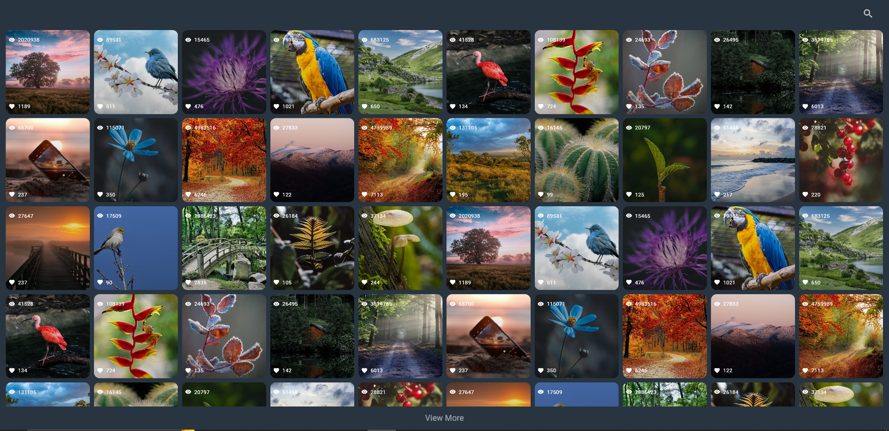
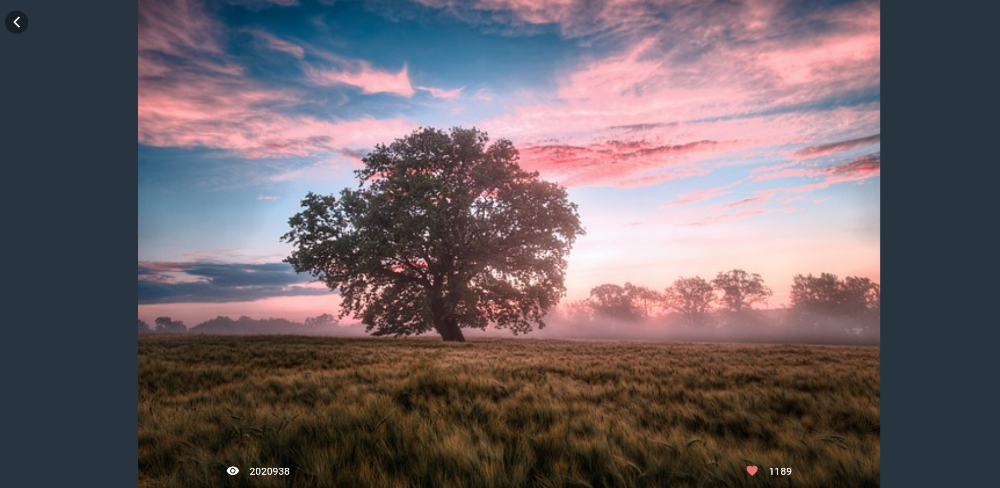

# Flutter Web App with Pixabay API

This is a Flutter web application that displays a gallery of images fetched from the Pixabay API. The images are displayed in a square grid, with the number of columns depending on the screen width. Users can also view the number of likes and views for each image.

## Features

- Images fetched dynamically from the [Pixabay API](https://pixabay.com/api/).
- Responsive grid layout that adapts to the screen width.
- Displays the number of likes and views under each image.
- "View More" button at the bottom of the grid to load more images without page reload.
- Search functionality to filter images based on keywords.
- Utilizes `GetX` for state management and network requests.

## Demo

Check out the live demo [here](https://deveshkhatuwal.github.io/GalleryApp/).

## Screenshots




## Getting Started

### Prerequisites

- Flutter SDK: You can install Flutter from the official site [here](https://flutter.dev/docs/get-started/install).
- A Pixabay API Key: You can get an API key by signing up on the [Pixabay API](https://pixabay.com/api/).

### Installation

1. **Clone the repository**:
   ```bash
   git clone https://github.com/your-github-username/your-repo-name.git
   cd your-repo-name
